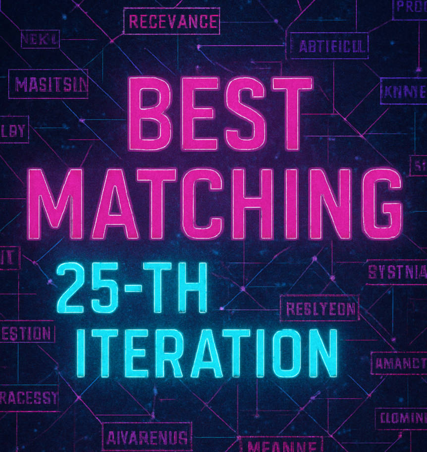
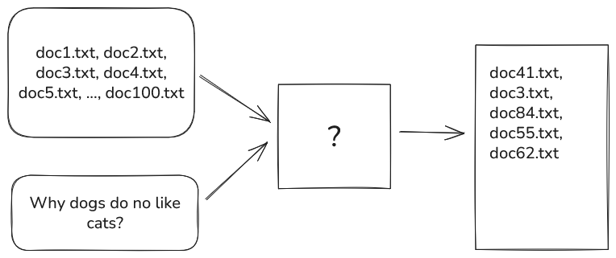
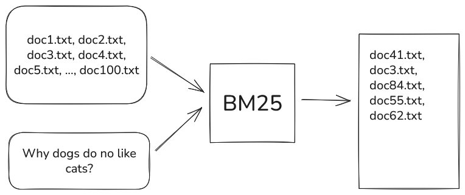

<!--  -->

<div align="center">
  

  # BM25 Search Engine

  ## Fast and lightweight BM25-based search engine implemented in JAVA
</div>


---

# What problem we are trying to solve ?

<style scoped>
p { text-align: center; }
</style>

<br/>



---

# Our solution to the problem

<style scoped>
p { text-align: center; }
</style>

<br/>



---

# What is BM25 ?

From wikipedia:

> BM25 is a bag-of-words retrieval function that ranks a set of documents based on the query terms appearing in each document, regardless of their proximity within the document.

---


# How to use ?

#### Step1 : Build index
```bash
$ java -jar target/bm25.jar build \
    -I=index.txt src/main/resources/documents
```

#### Step2 : Search using it
```bash
$ java -jar target/bm25.jar search \
    index.txt Which animal is the human best friend?
```

---

# How it works ? (build 1)

1. Read the content of files

```
"a cat is a feline and likes to eat bird",            // file1.txt
"a dog is the human's best friend and likes to play", // file2.txt
"a bird is a beautiful animal that can fly",          // file3.txt
```

---

# How it works ? (build 2)

2. split them
3. avoid meaningless words (is/a/to/etc)
4. stem them (connections, connected, connecting -> connect)

```
[
    ["cat", "felin", "like", "eat", "bird"],            // file1.txt
    ["dog", "human", "best", "friend", "like", "plai"], // file2.txt
    ["bird", "beauti", anim", "can", "fly"]             // file3.txt
]
```

---

# How it works ? (build 3)

5. build vocabulary

```
corpus = [
    ["cat", "felin", "like", "eat", "bird"],
    ["dog", "human", "best", "friend", "like", "plai"],
    ["bird", "beauti", anim", "can", "fly"]
]

vocabulary = [
    "like", "best", "plai", "can", "fly", "beauti", 
    "cat", "bird", "friend", "eat", "anim", "dog", "human", "felin"
]
```

---

# How it works ? (build 4)

6. For every token in every document compute BM25 scores
<br>

$$ 
log(\frac{N - df_t + 0.5}{df_t + 0.5} + 1) \cdot \frac{tf_{td}}{ k_1 \cdot (1 - b + b \cdot ( \frac{ L_d }{ L_{avg} } )) + tf_{td} } 
$$

---

# How it works ? (build 5)

6. Build document-term matrix with resulting BM25 scores

| docIdx | like | best | plai | can  | fly  | beauti | cat  | bird |
|--------|------|------|------|------|------|--------|------|------|
| 0      | 0.22 | 0.00 | 0.00 | 0.00 | 0.00 | 0.00   | 0.46 | 0.22 |
| 1      | 0.20 | 0.42 | 0.42 | 0.00 | 0.00 | 0.00   | 0.00 | 0.00 |
| 2      | 0.00 | 0.00 | 0.00 | 0.46 | 0.46 | 0.46   | 0.00 | 0.22 |


| docIdx | friend | eat  | anim | dog  | human | felin |
|--------|--------|------|------|------|-------|-------|
| 0      | 0.00   | 0.46 | 0.00 | 0.00 | 0.00  | 0.46  |
| 1      | 0.42   | 0.00 | 0.00 | 0.42 | 0.42  | 0.00  |
| 2      | 0.00   | 0.00 | 0.46 | 0.00 | 0.00  | 0.00  |

---

# How it works ? (search 1) 

1. Tokenize query

```
// From :
"Which animal is the human best friend?"

// To
[ "anim", "human", "best", "friend" ]
```

---

# How it works ? (search 2) 

2. Iterate over document-term matrix and accumulate corresponding tokens.

| docIdx | best | friend | anim | human | Result |
|--------|------|--------|------|-------|--------|
| 0      | 0.00 | 0.00   | 0.00 | 0.00  | 0.00   |
| 1      | 0.42 | 0.42   | 0.00 | 0.42  | 1.26   |
| 2      | 0.00 | 0.00   | 0.46 | 0.00  | 0.46   |


---

# Application

- Personal Document Library
- Email Archive Search
- Company Knowledge Base
- Real Estate Listings
- Customer Support Ticket System

---


# Roadmap - Current Limitations & Planned Improvements 

- **Include files in subfolders**

[Limitation] Doesn't read subfolders

```
build -I index.txt documents --recursive
```

- **Custom stopwords + turn off stemming**

[Limitation] stopwords List is hard-coded  

```
    build -I index.txt documents --stopwords my_words.txt --stem-off
```
- **Friendlier search results**

[Limitation] Doesn't Show what’s inside the index.

```
file2.txt score=1.26 [matched: dog, human, friend] "...dog is the human's best friend..."
```

- **Compressed sparse column (CSC) storage**
  
  [Limitation] plain-text LIL with string tokens


- **Unit testing**


<br>

# Thank you for your attention !


